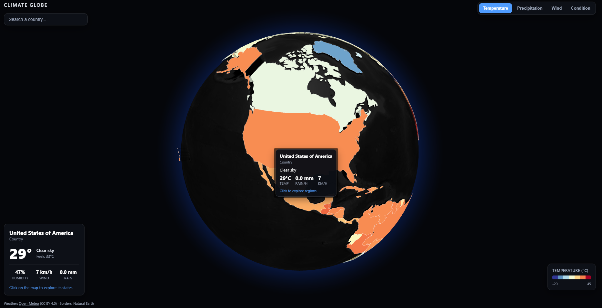

# Climate Globe

A 3D globe of live world weather — spin the Earth, hover any country
to see its current conditions, then click to see into its states and provinces.



## Try it

- Live demo: **https://climate-globe-dusky.vercel.app**
- Or run it locally in under a minute (see [Quick start](#quick-start)).

## Features

- **Live weather worldwide** — current temperature, "feels like", humidity, wind,
  precipitation, and sky condition for every country, from the free Open-Meteo API.
- **Drill into any country** — click to reveal that
  country's states/provinces, each individually shaded.
- **Four view modes** — color the map by Temperature, Precipitation, Wind, or
  Condition, with a matching legend.
- **Hover anywhere** — a tooltip and a detail card show that region's live stats.
- **Type-ahead search** — jump straight to any country by name.
- **No API keys**

## Quick start

Requires **Node 18+** (developed on Node 22).

```bash
npm install        # install dependencies
npm run fetch-data # download + slim the map data into public/data/
npm run dev        # start the dev server (http://localhost:5173)
```

`npm run fetch-data` must be ran once before the first `npm run dev`; it produces
`public/data/countries.json` and `public/data/states.json`.

## How it works

- **One globe, two views.** A single `react-globe.gl` (three.js) instance renders
  either the world's countries or one country's states. The app swaps the polygon
  data and the color/label accessors; the globe component itself stays stateless.
- **Batched weather.** Open-Meteo accepts many coordinates per request, so
  coloring ~177 countries is about two HTTP calls, not 177. Results are cached by
  rounded coordinate, so hovering and re-entering never refetch — this keeps the
  app comfortably within the free non-commercial limit.
- **Slimmed geometry.** The raw Natural Earth states file is 63 MB. A build
  script strips unused properties and rounds coordinates to 1 km, cutting it to
  17 MB, and it's loaded lazily only when you first see into a country.
- **Color is centralized.** A single `src/lib/colors.ts`

## Tech stack

- Vite + React + TypeScript
- react-globe.gl (three.js) for the 3D globe
- d3-geo (centroids, camera framing) and d3-scale / d3-scale-chromatic (colors)

## Project scripts

| Script | What it does |
|--------|--------------|
| `npm run dev` | Start the Vite dev server |
| `npm run fetch-data` | Download + slim the Natural Earth GeoJSON |
| `npm run build` | Type-check and build the production bundle |
| `npm run preview` | Preview the production build |

## Credits

- Weather data: [Open-Meteo](https://open-meteo.com/) (CC BY 4.0)
- Country & state borders: [Natural Earth](https://www.naturalearthdata.com/)
  (public domain), via the `martynafford/natural-earth-geojson` distribution
- Globe rendering: [react-globe.gl](https://github.com/vasturiano/react-globe.gl)
  and [three.js](https://threejs.org/)
